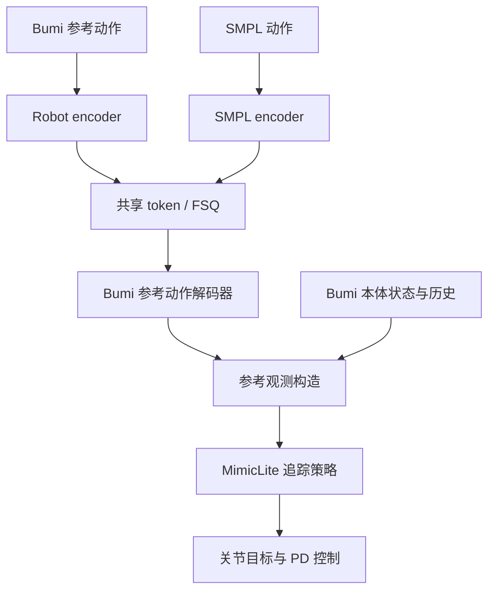

思路一：
## 结论

推荐走一条“同事的 MimicLite-BUMI 作为基线和教师，官方 MimicLite 作为设计标准，当前 SONIC_MimicLite 作为最终集成框架”的路线。

不要一开始就从官方 MimicLite 重新完整迁移 BUMI；也不要直接把同事的 MimicLite 策略当最终系统。最稳妥的做法是：

1. 先完整复现同事已经成功的 MimicLite-BUMI，冻结为基准。
2. 保留 SONIC 的多模态 encoder、64 维 universal token、FSQ/token 接口和 GENMO 接口。
3. 去掉或绕开 SONIC 当前很重的动作解码器。
4. 用 MimicLite 的短时域观测、轻量 actor、reward、termination、动作接口和高吞吐训练栈作为低层控制器。
5. 先冻结 MimicLite 低层，通过蒸馏/适配器接入 SONIC token；证明有效后才联合微调。

一句话就是：

> 保留 SONIC 的“动作语义和多模态入口”，替换 SONIC 的“物理执行与训练配方”。

---

## 为什么不能简单理解成“把 MimicLite 下层复制到 SONIC”

MimicLite 的速度不是来自单一网络模块，而是系统级组合：

- mjlab 的 GPU-native MuJoCo 后端；
- `torch.compile` 编译坐标变换、四元数、tracking error 等逐步计算；
- motion 数据按 rank 分片，只把本 rank 的 FP16 数据放到 GPU；
- 8192 甚至 16384 env/GPU 的大规模并行采样；
- 三层 MLP，而不是不断加深网络；
- 4 帧短未来窗口；
- global root drift 使用 truncation，而不是作为 failure termination；
- 简洁、可部署的 joint-position action + PD 接口；
- 固定 4000 update 的 PPO 配方。

技术报告明确把效率归因于 simulation throughput、parallel rollout、policy capacity 和 termination semantics 的联合设计，并特别说明 root-drift truncation 比 failure termination 更有利于动态动作探索。[MimicLite 技术报告](https://github.com/Roboparty/MimicLite/blob/main/mimic-lite.pdf)

当前官方实现的 actor 输入是 deployable proprioception 加短未来 command，critic 再使用 privileged tracking error；动作是经过逐关节缩放、随机延迟和插值的目标关节位置。[官方 tracking-base 配置](https://github.com/EGalahad/mimic-lite/blob/main/cfg/task/tracking-base.yaml)

而当前 SONIC：

- G1/SMPL encoder 是 `[2048, 1024, 512, 512]`：[g1_mf_mlp.yaml](/home/yingchaomu/下载/SONIC_MimicLite/gear_sonic/config/actor_critic/encoders/g1_mf_mlp.yaml:12)
- dynamics decoder 是 `[2048, 2048, 1024, 1024, 512, 512]`：[g1_dyn_mlp.yaml](/home/yingchaomu/下载/SONIC_MimicLite/gear_sonic/config/actor_critic/decoders/g1_dyn_mlp.yaml:14)
- 同时训练 G1、SMPL、teleop 编码、FSQ、运动学重建和 PPO；
- policy/critic 都使用 10 步历史；
- 默认训练预算高达 100000 iterations：[ppo_im_phc.yaml](/home/yingchaomu/下载/SONIC_MimicLite/gear_sonic/config/algo/ppo_im_phc.yaml:40)

所以如果保留整个 SONIC actor，只换 reward 或 PPO 参数，训练速度大概率不会变成 MimicLite。

---

## 推荐的混合架构

```text
Robot motion ─┐
SMPL ─────────┤
Teleop ───────┤
GENMO token ──┤
              ▼
    SONIC 多模态 Encoder / FSQ
           64-d token
              │
              ▼
  Short-command Adapter
  token → BUMI 短未来参考
  [t, t+1, t+2, t+4]
              │
              ▼
  MimicLite-BUMI 低层 Actor
  ├─ 稀疏 proprio history
  ├─ 最近 actions
  ├─ 短未来 reference
  └─ 输出 joint-position target
              │
              ▼
      BUMI PD / delay / interpolation
              │
              ▼
             Robot
```

Critic 单独使用：

```text
policy state + command + privileged tracking errors
```

### 保留的 SONIC 部分

- G1、SMPL、teleop 多模态 encoder；
- 64 维 motion token 接口；
- FSQ/codebook，初期冻结；
- 各模态 latent alignment；
- motion reconstruction 辅助任务；
- GENMO 直接产生 motion token 的协议；
- 上层 VLA/ZMQ/token streaming 接口。

### 替换或重构的部分

- 当前重型 `g1_dyn` decoder；
- 10 步连续历史，改为 MimicLite 的稀疏历史，例如 `[0,1,2,3,4,8,16]`；
- 10 帧长未来参考，先改成约 80 ms 的短时域命令；
- SONIC 严格 termination；
- root drift 的 failure termination；
- IsaacLab 逐步 tracking 计算热点；
- motion 数据的每 rank 重复驻留。

需要注意：GENMO 依赖的不是“有一个 64 维向量”这么简单，而是现有 token 的语义分布。因此第一阶段必须冻结 SONIC encoder/FSQ，不能直接重新定义 token 空间。

---

## 分阶段实施方案

### 阶段 0：审计同事的 MimicLite-BUMI

首先拿到并固定：

- 代码 commit SHA；
- 完整 Hydra/YAML 配置；
- checkpoint；
- observation 顺序和归一化统计；
- BUMI URDF/MJCF；
- 21 个关节的顺序；
- action scale、PD stiffness/damping；
- control dt、physics dt、decimation；
- reward、termination；
- motion 数据 manifest；
- 训练曲线和 W&B run；
- 导出及 sim2sim 配置。

当前仓库已经有严格的 BUMI joint/action/PD 契约和测试，应把同事系统逐字段对齐到这些契约，而不是凭关节数量相同就假设兼容。

### 阶段 1：原样复现同事基线

在相同数据、相同 BUMI 模型、相同 16 卡条件下，原样训练一次 MimicLite-BUMI。

必须得到基准：

- 到达可用效果所需 wall-clock；
- 4000 update 或其实际预算；
- LAFAN/自有动作 progress；
- global root XY drift；
- local body position/orientation error；
- joint error；
- fall/termination rate；
- 每 GPU FPS；
- 未见动作测试集表现。

如果同事的十几小时结果无法重复，就不应开始混合架构。

### 阶段 2：建立最小混合版 H1

先实现最安全的结构：

```text
冻结 SONIC encoder + FSQ
        ↓
训练 token → MimicLite short command adapter
        ↓
冻结同事的 MimicLite-BUMI actor
```

Adapter 输出建议包括：

- 短未来 joint position；
- local root orientation；
- local root displacement/velocity；
- 必要的 body-space reference。

先用现有 motion 数据做纯监督训练，不运行物理仿真。目标是证明 SONIC token 可以恢复 MimicLite actor 所需的 command。

### 阶段 3：策略蒸馏

让同事的 MimicLite-BUMI 策略作为 teacher：

```text
teacher action = MimicLite(reference, robot_state)
student action = hybrid(token, robot_state)
```

训练内容：

- action BC loss；
- latent/feature distillation；
- rollout DAgger，覆盖 student 偏离 teacher 轨迹后的状态；
- action smoothness；
- token reconstruction/consistency。

这一步能快速得到“会动且接近教师”的初始化，避免从随机 PPO 开始。

### 阶段 4：MimicLite 配方 PPO 微调

按 MimicLite 方式训练 hybrid：

- 32 rollout steps；
- 5 PPO epochs；
- 8 minibatches；
- actor LR 从 `3e-4` 或较保守的 `1e-4` 起；
- KL 目标从 `0.01` 收紧到 `0.005`；
- entropy 从 `0.01` 衰减到 `0.002`；
- BF16；
- short future command；
- root drift 超阈值时 truncation + value bootstrap；
- 不把水平 drift 直接判作动作失败；
- 先训练 adapter/head，再逐层解冻 MimicLite actor。

不要第一轮就联合解冻所有 SONIC encoder、FSQ 和低层 actor。

### 阶段 5：恢复多模态与 GENMO

按顺序增加：

1. G1 reference；
2. SMPL；
3. teleop；
4. GENMO token；
5. 模态混训。

每加入一种模态，都检查：

- token occupancy；
- 模态间 latent 距离；
- 同一动作跨模态 action 一致性；
- GENMO 旧 token 在新低层上的稳定性；
- 短 future horizon 是否影响生成动作的前瞻性。

如果旧 GENMO token 经新低层后明显退化，应训练一个小型 `legacy-token adapter`，不要立刻重训 GENMO。

---

## 必须做的消融实验

不要直接比较“原 SONIC”和“最终混合版”，否则无法知道提升来自哪里。

建议至少训练以下版本：

| 版本 | 目的 |
|---|---|
| S0：当前 SONIC-BUMI | 原始基线 |
| M0：同事 MimicLite-BUMI | 目标基线 |
| M1：MimicLite backend + SONIC reward/termination | 测吞吐贡献 |
| M2：MimicLite backend + MimicLite reward/termination | 测学习配方贡献 |
| H1：冻结 MimicLite actor + token-command adapter | 最低风险混合 |
| H2：token + 轻量三层 dynamics actor | 测是否需要完整 MimicLite actor |
| H3：H2 + FSQ/多模态联合微调 | 最终候选 |

所有版本必须使用同一：

- BUMI 动力学模型；
- 训练动作集合；
- hold-out 动作集合；
- 环境数/总 samples；
- 评测 termination；
- sim2sim 路径。

---

## 关于“低数据需求”的重要修正

目前还不能仅凭同事的小数据训练结果断言 MimicLite 天生比 SONIC 更低数据需求。

官方技术报告列出的统一数据中，SONIC 数据本身约有 288.3 小时；当前官方 mixture 也给 SONIC 数据较高权重。最新公开 checkpoint 使用的是 `16 × 16384` 环境，PPO 版本报告约 92.3 GPU-hours，而不是所有版本都只需要 24 GPU-hours。[官方最新 README](https://github.com/Roboparty/MimicLite)

因此，同事十几小时收敛也可能来自：

- BUMI 数据更干净；
- retargeting 更准确；
- 动作范围更窄；
- termination 更宽松；
- 仿真吞吐更高；
- checkpoint warm start；
- 测试集与训练集重叠；
- 评价指标不同。

必须在完全相同的 BUMI 数据 split 和 matched evaluation 下验证“数据效率”。

---

## 最终选择建议

选择“借用同事的 mimicLite_bumi 框架和策略”，但限定用途：

- 框架：作为最快的 BUMI 可运行基线；
- checkpoint：作为 teacher、warm start 和回归标准；
- 官方 MimicLite：作为上游参考、配置和算法依据；
- 当前 `SONIC_MimicLite`：作为最终产品仓库和多模态集成框架。

不建议：

- 从官方 MimicLite 零开始重新做一遍 BUMI 迁移；
- 直接在同事仓库里继续堆 SONIC universal token；
- 把同事 checkpoint 直接塞进 SONIC actor 后端并端到端训练；
- 第一轮就保留 FSQ、全部重建损失、三种 encoder 和重型 dynamics decoder 一起 PPO。

最优先实现的是 H1：`冻结 SONIC token + short-command adapter + 冻结 MimicLite-BUMI actor`。它对 GENMO 兼容性破坏最小，也最容易判断“SONIC 上层 + MimicLite 下层”这个核心想法是否成立。


思路二：
**你的想法可行，也值得做。最有希望的路线是：保留 SONIC 的双路编码器、共享 token 和多模态输入接口，用 MimicLite 的训练方法先获得一个好的 Bumi 追踪器，再把两者连接起来。**

但需要把两个判断分开：**架构能够实现；“十几个小时训练完，同时获得更强泛化和追踪效果”需要实验验证，不能通过替换一个 decoder 自动获得。** 我更建议分阶段实现，让每一步都能判断收益来自哪里。

下面基于目前的官方论文、训练与部署文档、公开评测分析；你和同事的具体配置、训练日志尚未对照，因此训练速度差异的具体原因还不能确定。

先澄清三个直接影响方案的地方。

| 问题                                 | 对你的方案意味着什么                                                               |
| ---------------------------------- | ------------------------------------------------------------------------ |
| PICO 五点遥操经过全身姿态重建，再进入 SMPL encoder | 路线成立。它是第三个**输入入口**，网络仍然只有 robot、SMPL 两个 encoder；SONIC 论文的全身遥操也是走人体动作编码器。 |
| hybrid encoder 与 planner 的关系       | 两者是不同模块。当前 SONIC 官方文档已经列出 teleop encoder 的训练和导出，是否缺失需要对照你使用的分支确认。        |
| GENMO 是否必须配原版 SONIC token          | GENMO 通过生成的人体动作接入人体编码器，因此你重新训练 Bumi 的 token 空间，也能保留这种接口。                 |

前两项分别见 [SONIC 论文](https://arxiv.org/html/2511.07820v1)和[当前训练文档](https://nvlabs.github.io/GR00T-WholeBodyControl/user_guide/training.html)。GENMO 的连接方式也在论文中明确描述。

这里要区分：**保留 SONIC 的架构与接口，不等于保留 NVIDIA 预训练 token 的数值语义。** 如果未来接入的是已经训练成“直接输出原版 SONIC latent”的 VLA，重新训练 token 后就需要适配；当前官方 VLA 确实直接预测 64 维 SONIC latent。[官方 VLA 工作流](https://nvlabs.github.io/GR00T-WholeBodyControl/tutorials/vla_workflow.html)

你现在主要考虑 robot、SMPL、PICO、GENMO，因此我建议优先保留架构，为 Bumi 学习合适的表示。

**MimicLite 的结果支持你做这个方向，但目前还不能把“训练快”全部归因于底层网络。**

当前公开 MimicLite-PPO 使用 `[1024,1024,1024]` actor，报告训练成本为 **92.3 RTX 4090 GPU-hours**；ROA 版本为 **173.2 GPU-hours**，公开配置涉及 16 张 GPU。它们和你同事的版本、十几小时训练配置未必相同。[MimicLite 官方仓库](https://github.com/Roboparty/MimicLite)

作者维护的统一评测中，默认展示的 locomotion/manipulation 汇总结果，MimicLite-PPO 的局部身体误差低于 SONIC，但动作完成进度为 **97.6% 对 100%**。这说明“部分追踪指标更好”和“所有动作都更可靠”需要分别验证。[公开评测及协议](https://egalahad.github.io/sim2real/leaderboard/)

对于你观察到的三天与十几小时差距，应重点对照：

| 对照项                  | 为什么会影响结论             |
| -------------------- | -------------------- |
| GPU 型号、数量、实际占用       | 决定墙钟时间是否可直接比较        |
| 动作类别、有效小时数、重定向质量     | 少量相似动作与广泛技能集合的训练难度不同 |
| 从零训练还是加载 checkpoint  | 决定此前训练成本是否被隐藏        |
| actor 观测、历史、未来帧、特权信息 | 决定学习问题本身的难度          |
| 奖励、终止条件、初始化、采样       | 决定每批仿真样本的学习价值        |
| 仿真、PPO、辅助损失、数据加载各自耗时 | 决定应该优化哪个模块           |

SONIC 本身也采用 PPO，并且已经有自适应动作采样。因此，不能简单认为“换 PPO”或者“加困难动作采样”就能获得 MimicLite 的速度。SONIC 官方文档还专门提醒：失败统计必须归到 **reset 前的 motion/frame**；这个归因出错会削弱自适应采样，值得先检查你的分支。[SONIC 训练说明](https://nvlabs.github.io/GR00T-WholeBodyControl/user_guide/training.html)

我的工程判断是：**你应该借鉴同事已经验证的完整追踪训练配置和实现，再把多模态表示学习从主要的 RL 训练阶段中拆出来。**

推荐先实现下面这个版本：



其中，GENMO 和经过全身重建的 PICO 数据，都进入图中的 SMPL 入口。

这个连接方式有一个实际优势：**可以保留已经训练好的 MimicLite 策略，通过明确的 Bumi 参考动作接口接入 token。** SONIC 原架构已有用于辅助重建的运动学 decoder；这里将类似模块改成实际运行的 Bumi 参考动作解码器，这是本方案提出的改动。[SONIC 编码与解码结构](https://nvlabs.github.io/GR00T-WholeBodyControl/references/training_code.html)

落地可以按以下顺序做。

1. **先得到同样条件下的 Bumi 追踪基线。**

   如果同事的策略已经运行在相同 Bumi 上，可以直接作为起点；如果他使用的是 G1，需要先训练 Bumi 版本。G1 的动作输出不能直接作为 Bumi 的控制监督。

   首轮尽量完整沿用同事验证过的观测、奖励、采样、初始化和 PPO 配置，只完成必要的 Bumi 适配：机器人模型、关节顺序、动作尺度、PD、力矩限制和追踪 body。

   同时使用同一组 Bumi 动作，对现有 SONIC 与 MimicLite 做评测。**只有 MimicLite 的速度和效果优势在这个对照中成立，后续融合才有可靠基础。**

2. **建立严格配对的 SMPL—Bumi 动作数据。**

   每个训练样本至少对应：

   $$
   \bigl(g_H(t:t+H),\;g_B(t:t+H)\bigr)
   $$

   两边必须来自同一动作、同一时间段。其中：

   | 数据      | 建议保留的内容                          |
   | ------- | -------------------------------- |
   | SMPL 参考 | 标准化人体关节位置、根姿态及必要的根运动信息           |
   | Bumi 参考 | 关节位置/速度、根姿态/高度/运动、追踪 body 的运动学信息 |
   | 时间与标定   | 时间戳、采样率、坐标约定、尺度和有效帧标记            |

   你已有的 SMPL 与 Bumi 重定向数据可以复用，重点检查时间对齐、转向、脚底高度和关节速度。**只有机器人 NPZ、没有对应人体动作，无法充分训练你要的 SMPL 路。**

   初期可以用约 **500–2000 条经过清洗、覆盖目标动作类别的配对序列**进行验证。这只是实验起点，不能据此认定这些数据足以获得广泛泛化。

3. **先用监督学习训练 token 与参考动作解码器。**

   定义：

   $$
   z_B=Q(E_B(g_B)),\qquad z_H=Q(E_H(g_H))
   $$

   $$
   \hat g_B=D_{\mathrm{ref}}(z)
   $$

   两路都要重建同一段 Bumi 参考动作。第一版损失可以采用：

   $$
   \mathcal L_{\mathrm{rep}}
   =
   \sum_{m\in\{B,H\}}
   \|D_{\mathrm{ref}}(z_m)-g_B\|_W^2
   +
   \lambda_{\mathrm{align}}
   \|\tilde z_H-\operatorname{sg}(\tilde z_B)\|^2
   $$

   这里，\(\tilde z\) 是量化前表示，\(W\) 用于平衡不同物理量，`sg` 表示停止梯度。

   训练顺序建议是：先训练 robot 自编码器获得可重建的表示，再以它为锚点训练 SMPL 路，最后视需要联合微调。这样可以避免两路只靠对齐损失学出没有动作信息的表示。

   重建目标要包含关节、根运动和通过 Bumi FK 得到的关键 body 位置；对旋转使用合适的旋转误差。**单纯把关节角 MSE 降低，不足以证明脚部接触和运动节奏正确。**

   这一阶段主要使用离线配对数据，不需要每次更新都进行物理仿真，是减少训练成本的主要机会之一。

4. **将解码出的参考动作接入冻结的 MimicLite 策略。**

   运行关系是：

   $$
   a_t=\pi_M\!\left(o_t,\,
   \operatorname{ObsRef}(\hat g_B,o_t)\right)
   $$

   `ObsRef` 必须构造出与原追踪器训练时相同含义的观测。MimicLite 部署文档中的参考观测包括未来关节角、局部 body 位置、根姿态等，不能只把一个 64 维 token 塞进原来的输入位置。[MimicLite 参考观测说明](https://egalahad.github.io/sim2real/reference/tracking-framework/)

   按三个条件依次评测：

   * 真实 Bumi 参考动作 → MimicLite。
   * robot encoder → token → 重建参考动作 → MimicLite。
   * SMPL encoder → token → 重建参考动作 → MimicLite。

   这样可以分别识别**表示压缩损失**和**人体到机器人映射损失**。

   首先冻结追踪器，只调整前端；如果重建参考的误差分布导致明显掉点，再用这类参考做少量追踪器微调。训练成本也必须包含这部分。

5. **桥接版本达到要求后，再考虑蒸馏成 token 直接控制。**

   如果你希望最后的结构更接近 SONIC：

   $$
   a_t=\pi_{\mathrm{token}}(o_t,z_t)
   $$

   可以用已经验证的 Bumi MimicLite 策略作为 teacher，训练 token-conditioned student：

   $$
   \mathcal L_{\mathrm{act}}
   =
   \left\|
   \mu_{\mathrm{student}}(o_t,z_t)
   -
   \operatorname{sg}\!\left(
   \mu_{\mathrm{teacher}}(o_t,g_B)
   \right)
   \right\|^2
   $$

   两边应使用相同的动作定义与尺度，优先监督 teacher 的动作均值。**teacher 和 student 必须在同一个机器人状态上计算动作。**

   离线模仿之后，要让 student 自己在仿真中运行，再由 teacher 对 student 到达的状态提供标签，也就是 DAgger 思路；否则只学习 teacher 的理想轨迹，容易在出现偏差后失去恢复能力。[DAgger 原论文](https://proceedings.mlr.press/v15/ross11a.html)

   最后进行少量 PPO 微调，保留一定 teacher 约束以减少能力退化。teacher 的额外未来信息或特权信息如果 student 无法获得，也需要单独处理，蒸馏不会自动补齐缺失的信息。

   **这个阶段是可选优化。** 如果桥接版本已经满足控制周期和追踪要求，可以先用它完成 robot、SMPL、PICO、GENMO 的系统目标。

第一轮网络规模可以采用以下实验起点。这些是我的建议配置，不是 MimicLite 的原始参数，也不是经过 Bumi 验证的最优值。

| 模块                   | 建议起点                        |
| -------------------- | --------------------------- |
| Robot / SMPL encoder | 各自使用 `[512,256]` MLP        |
| 共享表示                 | 64 维，先完成连续表示对照，再接 FSQ       |
| Bumi 参考动作 decoder    | `[512,512]` MLP             |
| 底层追踪策略               | 先保持同事成功配置                   |
| 直接 token student     | 参考 teacher 的网络规模            |
| 训练方式                 | 追踪器 PPO → 表示监督训练 → 必要时蒸馏与微调 |

使用 64 维方便延续接口，但不代表自动兼容原版 token。已有 Bumi encoder 如果表现不错，可以用于初始化；量化方式、输入含义或参考时间窗口变化后，都需要重新验证。

**PICO 部分最容易隐藏的问题，是“训练时有未来，现场没有未来”。**

假设策略需要参考步 `[0,1,2,3,4]`，控制频率为 50 Hz，那么最远需要 80 ms 后的动作。离线播放可以直接读取，实时遥操通常需要等待缓冲，或者预测未来。

对你的第一版，我建议：

* 使用明确的短参考窗口，通过时间戳缓冲保证训练与运行时含义一致。
* 将 PICO 全身重建产生的噪声、抖动和短时缺帧加入训练输入。
* 分别测量姿态重建耗时、网络与缓冲延迟、策略推理耗时。
* 后续如果需要进一步降低延迟，再训练使用历史/当前帧的模型或未来预测模块。

**不要在部署时临时重复当前帧填满未来窗口，却仍按真实未来帧训练。** 同样，SMPL 输入要统一骨架顺序、尺度和根坐标定义；直接使用 XR 原始关键点未必满足 encoder 的输入约定。[SMPL 输入转换说明](https://egalahad.github.io/sim2real/reference/sonic-smpl-input/)

朝向也建议作为专项验收：初始化对齐后，要保留动作中的相对转向变化，避免每步重新对齐把转向指令消掉。

最后，需要用下面这组实验判断是否达到你设想的效果。

| 实验                         | 验证目标               |
| -------------------------- | ------------------ |
| 当前 SONIC-Bumi              | 记录现有训练成本和效果        |
| 相同条件的 MimicLite-Bumi       | 确认底层优势是否能在 Bumi 复现 |
| MimicLite + robot token 桥接 | 测量加入共享表示的损失        |
| 再加入 SMPL 路                 | 测量跨模态映射的损失         |
| PICO 录制数据回放与实时输入           | 测量噪声和延迟影响          |
| 可选的 token 直接控制版本           | 判断蒸馏是否值得增加训练成本     |

所有实验固定机器人模型、评测动作、控制频率和失败标准，并同时记录：

* **效果：**动作完成率、局部身体误差、根轨迹误差、手脚误差、滑脚和控制抖动。
* **成本：**墙钟时间、GPU-hours、仿真步数、达到统一效果门槛所需时间。
* **泛化：**按原始序列和来源划分未见动作，避免相邻片段泄漏；另外测试未见组合、速度和 PICO 动作。
* **多模态一致性：**同一动作在 robot、SMPL 路之间切换时是否保持行为一致。

可以先把立项门槛设为：**在相同硬件上，总训练成本降至当前方案的约三分之一；robot 路尽量保持 MimicLite 基线，SMPL 路误差增幅控制在预先约定范围，完成率不能明显下降。** 这些是验收目标，不是效果预测。总成本要包含追踪器、前端、蒸馏和微调，不能只计算最后一步。

对于你提出的几个目标，我的判断是：

| 目标                                    | 判断                    |
| ------------------------------------- | --------------------- |
| 保留双路 encoder、共享 token、PICO 与 GENMO 接口 | **可实现**               |
| 明显降低主要 RL 训练阶段的成本                     | **有充分理由尝试，幅度待测**      |
| 保持接近 MimicLite 的追踪质量                  | **桥接路线更容易逐步验证**       |
| 整套多模态模型十几个小时完成训练                      | **可能，但目前没有足够证据承诺**    |
| 使用更少数据仍获得广泛的新技能泛化                     | **不能由架构保证，依赖动作覆盖与质量** |
| 直接拼接两套预训练权重就获得全部优势                    | **不成立，需要接口适配和训练**     |

你现在最值得做的第一轮工作，是拿到同事成功实验的 **commit、完整配置、动作清单和学习曲线**，在统一 Bumi 条件下建立基线，然后只增加 **robot token → Bumi 参考动作 decoder** 这一条链。它能最快回答整个方案最关键的问题：**加入你想保留的表示层后，是否还能保住底层追踪器的速度与效果。**

---
---

思路三（Claude）：

# 评估与方案

本节基于对 `SONIC_MimicLite` 仓库当前实际代码/配置的核实（不是转述上面两份草稿的引用），
给出对思路一、思路二的评估结论，以及我自己的方案。所有涉及"当前仓库如何实现"的表述，
都已用 `Read`/`grep` 核实过具体文件，路径和取值均为实测。

## 0. 先说结论

1. **两份草稿在最终选择上已经收敛**：都主张"借同事 MimicLite-BUMI 的 checkpoint 做下层起点、
   冻结优先、分阶段验证、不要一次性端到端联合训练"，都明确反对"从官方 MimicLite 重新做一遍
   BUMI 迁移"和"直接拼接两套预训练权重"。这个收敛结论本身就是较强信号，我同意。
2. **两者的分歧在"桥接层应该解码到哪一层"**：思路一主张 token → 直接学一个 MimicLite 的
   "短未来 command"输入张量（逼近 MimicLite actor 的私有输入格式）；思路二主张 token → 显式
   Bumi 参考动作（关节角/根姿态等物理量），再复用 MimicLite 已有的观测构造管线。
   **我复核了本仓库现有代码后，明确支持思路二这一侧的选择**，理由见 §1，且发现本仓库里
   已经有一个几乎同构的模块可以直接复用/改造，而不是从零设计（两份草稿都没有提到这一点）。
3. **思路一的分阶段消融矩阵（S0/M0/M1/M2/H1/H2/H3）是目前三份方案里最严谨的验证设计**，
   我原样采纳，只做少量精简和补充部署侧的检查项（见 §4）。
4. **对"迁移到 bumi 重新训练 vs 借用同事框架"这个问题，我的答案是：以借用同事的
   MimicLite-BUMI checkpoint 和框架作为主线，但必须先做一次不依赖对方协助的独立契约审计
   （见 §2），因为本仓库自己就发生过一次同类事故**——`BUMI3_SONIC_修改记录.md`
   2026-08-26 记录了"将误用的 BUMI2 集成完整迁移为 BUMI3"，说明"关节数量/命名相似就当成
   兼容"这个假设在本项目里已经实际导致过错误集成。这不是假设性风险，是本仓库的真实前科，
   必须作为 Phase 0 的强制项，而不是可选检查。

## 1. 为什么支持"解码到显式参考动作"而不是"学一个私有 command adapter"

关键证据：本仓库的 SONIC 实现**已经内置了同构的模块**，只是目前只被当作训练时的辅助正则项，
没有被当成一个可独立复用的部署组件：

- G1 encoder 的输入是 `["command_multi_future_nonflat", "motion_anchor_ori_b_mf_nonflat"]`
  （[g1_mf_mlp.yaml](gear_sonic/config/actor_critic/encoders/g1_mf_mlp.yaml:2)）。
- 与之对称，本仓库另有一个 `g1_kin` decoder，输入是 `["token"]`，输出**正好是同一组字段**
  `["command_multi_future_nonflat", "motion_anchor_ori_b_mf_nonflat"]`
  （[g1_kin_mf_mlp.yaml](gear_sonic/config/actor_critic/decoders/g1_kin_mf_mlp.yaml:2-3)），
  网络结构是 `[2048,1024,512,512]` 的 MLP。
- 它在 `aux_losses` 里以 `g1_recon`（权重 `0.01`）的形式参与训练
  （[g1_recon_and_smpl_latent.yaml](gear_sonic/config/aux_losses/universal_token/g1_recon_and_smpl_latent.yaml:12-15)），
  目的是让 token 保持"可重建出真实参考动作"的语义，防止只靠 latent 对齐损失学出没有动作信息的
  表示——这正是思路二里 `\mathcal L_{\mathrm{rep}}` 公式想要的东西，只是当前它的重建目标是喂回
  SONIC 自己的 dynamics decoder，而不是喂给一个外部策略。

**结论**：思路二要做的"token → 显式参考动作 decoder"，在架构范式上不是新发明，而是把
`g1_kin` 这个现成模式从"训练期辅助正则"提升为"部署期真正被下游消费的输出"，训练目标、
网络规模、输入输出字段都可以直接沿用现有配置作为起点，只需要：

1. 把重建目标从"SONIC 自己的 `command_multi_future_nonflat` 格式"改/扩展成
   "MimicLite-BUMI 实际消费的参考动作格式"（两者是否同构、如何转换，是 Phase 0 要搞清楚的
   第一件事）；
2. 把这个 decoder 的产出当作**一条合法的、可以离线播放和 sim2sim 回放的参考动作**，而不是
   直接塞进 MimicLite 策略网络内部的私有张量位置。

这样做的工程收益是：解码结果可以直接用现有的
[`tools_local/run_bumi3_sim2sim_nvidia.sh`](tools_local/run_bumi3_sim2sim_nvidia.sh) /
`bumi3_motion_dataset.py` 之类的回放工具肉眼验证（"decoder 输出的动作长得像不像原动作"），
而不需要先搞懂 MimicLite actor 内部归一化、历史拼接、corruption 等私有实现细节才能调试第一版——
这一点思路一的"学一个逼近 MimicLite 输入张量的 adapter"做不到，只能靠"策略最终表现"这种
延迟反馈来调试，出问题时无法区分是 decoder 语义错了还是 adapter 拟合不够。

思路二本身也承认这一点的重要性（"ObsRef 必须构造出与原追踪器训练时相同含义的观测……不能只把
一个 64 维 token 塞进原来的输入位置"），但没有指出仓库里已经有现成先例可以复用，我在此补上。

## 2. Phase 0：独立契约审计（在任何训练开始前，两条路线都必须做）

这一步两份草稿都提到了，但都还没有执行。鉴于本项目已有 BUMI2/BUMI3 误用的前科，这里给出
可执行的核对清单，建议作为一次独立、可交付的任务先跑完，再决定后续怎么走：

| 审计项 | 来源 | 核对方法 |
|---|---|---|
| 同事 MimicLite-BUMI 的 commit SHA、完整 Hydra/YAML | 同事仓库 | 直接要 commit hash + `git archive`/`git bundle`，不要口述转述的参数 |
| BUMI 型号是否与本仓库的 BUMI3 一致 | 同事的 URDF/MJCF | 对比关节名、关节数、body 数与本仓库 `gear_sonic/config/exp/manager/universal_token/all_modes/sonic_bumi3.yaml:186-231` 里锁定的 21 个 DoF 名单逐条比对；不一致立即停止，不假设"差不多" |
| action scale / PD stiffness-damping / control dt / decimation | 同事配置 + 本仓库 `deploy.md`、`tools_local/run_bumi3_sim2sim_nvidia.sh` | 逐字段 diff；本仓库当前实测用的是显式 PD、8 个肩肘关节 armature=0.01（`BUMI3_SONIC_修改记录.md` 2026-09-10 附近记录），必须确认同事版本是否相同假设 |
| reward / termination | 同事配置 | 对照本仓库 `manager_env/terminations/tracking/base_adaptive_strict_ori_foot_xyz`、`rewards/tracking/base_no_local_keypoint_no_anti_shake_feet_acc` |
| checkpoint 与数据集的对应关系 | 同事说明 | 确认十几小时收敛的 checkpoint 训练时用的是哪个数据集版本、多少条动作、是否与本仓库 `bumi3_smpl_97660_v1` / HQ4 PASS-only 数据同源或可对齐 |
| 训练成本口径 | 同事说明 + 官方 MimicLite README | 官方 MimicLite-PPO 公开配置报告约 **92.3 RTX 4090 GPU-hours**（16 卡量级），ROA 版本约 **173.2 GPU-hours**；先确认同事的"十几小时"是单卡口径、8 卡口径还是别的，不能直接和这两个数字或本仓库的"8 卡 3 天≈576 GPU-hours"比"墙钟天数"，要统一换算成 GPU-hours 再比 |

本仓库当前一次完整 BUMI3 SONIC 训练的真实口径（供换算用，实测自
`BUMI3_SONIC_修改记录.md`）：8 张 GPU、每卡 `num_envs=4096`、`num_steps_per_env=24`、
目标 `num_learning_iterations=100000`；2026-09-09 从零启动，2026-09-10 已到 iteration
`30622`（`model_step_030000.pt`），按此速度换算完整 100k iteration 约需 **3 天多**、
折合约 **576+ GPU-hours**（8 卡 × 3 天 × 24 小时），与你反馈的"训练 3 天才有效果"量级吻合。
这个数字本身也说明：即使不考虑同事的方案，仅仅用本仓库已有的 8 卡资源跑满 100k iteration，
成本就已经是官方 MimicLite-PPO 报告成本（92.3 GPU-hours）的 6 倍以上——**这个量级差距已经
足够大，值得认真推进混合方案，但具体差距有多少来自"网络更重+训练预算更大"、多少来自
"数据规模/多任务目标"，仍要按思路一的消融表格逐项拆开，不能只归因于"底层网络"。**

## 3. 我的架构方案

### 3.1 链路图

配色沿用本仓库官方部署图 [`media/Pipeline.jpg`](media/Pipeline.jpg) 的视觉语言（浅蓝=输入/接口，
紫色=运动语义/规划层，绿色=表示管理/重建层，橙色=策略，灰色=机器人本体），并借鉴 SONIC 论文里
"多模态 encoder 汇入共享 token 瓶颈、单一 decoder 输出"的拓扑，以及 MimicLite 报告里
"短历史 + 短未来 + 轻量 actor + PD"的下层结构。图中用色块区分**冻结/复用/新增**三类模块，
这是两篇论文各自的图都没有的信息，是本方案需要额外强调的部分：

```mermaid
flowchart LR
    classDef input fill:#BFE3F0,stroke:#4488AA,stroke-width:1px,color:#0b2b36;
    classDef sonic fill:#E4C6EE,stroke:#9B59B6,stroke-width:1px,color:#3a1747;
    classDef bridge fill:#BFEAC5,stroke:#3FA34D,stroke-width:1px,color:#0d3315;
    classDef mimic fill:#F7D9BF,stroke:#D2782B,stroke-width:1px,color:#5a2a05;
    classDef robot fill:#E8E8E8,stroke:#888888,stroke-width:1px,color:#222222;

    subgraph IN["多模态输入（不变）"]
        direction TB
        I1["Robot 参考动作"]:::input
        I2["SMPL / GENMO 动作"]:::input
        I3["PICO 五点重建"]:::input
    end

    subgraph SONIC["SONIC 上层 — 原样冻结"]
        direction TB
        E1["Robot encoder<br/>[2048,1024,512,512]"]:::sonic
        E2["SMPL encoder<br/>[2048,1024,512,512]"]:::sonic
        TOK["共享 64 维 token<br/>FSQ 量化"]:::sonic
        E1 --> TOK
        E2 --> TOK
    end

    subgraph BRIDGE["新增桥接层 — 本方案要训练的部分"]
        direction TB
        DEC["g1_kin 式参考动作 decoder<br/>token → 显式 Bumi 参考动作<br/>joint_pos / joint_vel / body_pos+quat / root"]:::bridge
        FRAME["视为合法 Bumi motion-lib 帧<br/>可用现有 sim2sim 工具直接回放核验"]:::bridge
        DEC --> FRAME
    end

    subgraph MIMIC["MimicLite-BUMI 下层 — 借用同事、先冻结"]
        direction TB
        OBS["ObsRef 观测构造<br/>短历史 + 短未来窗口<br/>（同事已验证的原实现）"]:::mimic
        ACT["MimicLite Actor<br/>轻量 MLP，PD 接口"]:::mimic
        OBS --> ACT
    end

    ROBOT["Bumi 本体<br/>PD 执行"]:::robot
    EVAL["离线/sim2sim 评测<br/>重建误差 · 追踪误差 · 跌倒率"]:::bridge

    I1 --> E1
    I2 --> E2
    I3 -.-> E2
    TOK --> DEC
    FRAME --> OBS
    ACT --> ROBOT
    ROBOT -.状态反馈.-> OBS
    FRAME -.核验.-> EVAL
    ACT -.核验.-> EVAL
```



图例：**紫色（SONIC 上层）与橙色（MimicLite 下层）在第一阶段都整体冻结，只训练绿色的桥接
decoder**；灰色是最终部署对象；绿色的评测节点对应 §4 表格里"阶段2/3"的停止信号检查点。
后续阶段（蒸馏、联合微调）会把橙色模块从"冻结"改为"部分解冻"，但拓扑本身不变。

### 3.2 与官方两张图的对应关系

- 对照 SONIC 论文的多模态 encoder 图：本图的 `IN → SONIC` 部分完全照抄其拓扑（多输入 → 独立
  encoder → 共享 token），没有改动，这也是"保留 SONIC 上层"这句话在图上的确切含义。
- 对照 MimicLite 报告的追踪器图：本图的 `MIMIC → ROBOT` 部分完全照抄其"观测→actor→PD→机器人"
  拓扑，且刻意不在这一层引入任何 SONIC 的重型 decoder 结构，这是"借鉴 MimicLite 下层"的确切
  边界。
- `BRIDGE` 子图是本方案在两篇论文之外新增的唯一部分，对应 §1 里提到的、由本仓库现成的
  `g1_kin` 模块改造而来的 decoder；它两侧分别对接 SONIC 的 token 输出格式和 MimicLite 的
  参考动作输入格式，是整个方案里**唯一需要从零训练**的模块，也是风险最集中的地方，
  所以 §4 的分阶段计划把它单独拆成阶段 2（纯离线监督，不跑物理仿真）先验证。

### 3.3 文字版架构（供不支持 Mermaid 渲染的场合参考）

```text
Robot 参考 ──► Robot encoder ─┐
SMPL/GENMO ──► SMPL encoder ──┤
PICO 五点重建 ─────────────────┘        共享 64 维 token（FSQ，先冻结）
                                              │
                              ┌───────────────┴───────────────┐
                              │                                │
                    g1_kin 式参考动作 decoder          （可选，阶段5+）token-conditioned
                    token → 显式 Bumi 参考动作           轻量 student actor（蒸馏产物）
                    [joint_pos, joint_vel,
                     body_pos/quat, root 状态]
                              │
                              ▼
              视为一条合法的 Bumi motion-lib 帧
              走 MimicLite-BUMI 已验证的
              观测构造管线（ObsRef）
                              │
                              ▼
              冻结的 MimicLite-BUMI 追踪 Actor
              （同事已验证，短历史 + 短未来 + PD 接口）
                              │
                              ▼
                    关节目标 + PD → Bumi
```

要点：

- **第一阶段只解码到"显式参考动作"这一层，不解码到策略私有输入**，原因见 §1。
- **SONIC 侧的 FSQ/token/双编码器/latent 对齐损失原样保留并冻结**，避免第一阶段就破坏
  GENMO 数据路径的兼容性——本仓库 `gear_sonic/tools/prepare_bumi3_sonic_dataset.py` 显示
  GENMO 目前的实际接入方式是**离线生成 SMPL/Robot 动作片段、走标准 motion-lib 流程**
  （`genmo.bumi_legacy_motion.v1` / `genmo.bumi_csv_qpos_xyzw.v1` 契约），并不是一个运行时
  的实时接口；这意味着"SONIC 天生适配 GENMO"目前的真实含义是"GENMO 产出可以当成 SMPL
  encoder 的一条训练数据"，新方案只要保证 SMPL encoder 的输入格式不变，就自动保留这个兼容性，
  不需要额外为 GENMO 单独开发接口。
- **底层 Actor 初期整体冻结**，蒸馏（思路一的阶段3、思路二的第5步）作为后续可选优化，不是
  第一阶段目标。
- **部署链路是本仓库独有的、两份草稿都低估的成本项**：当前 `models/deployment/{robot,smpl}/`
  下的 ONNX、`tools_local/run_bumi3_sim2sim_nvidia.sh`、`run_bumi3_pico_sim2sim_nvidia.sh`
  和 PICO 五点遥操整条链路，都是围绕**当前 SONIC dynamics decoder 的输入输出契约**（1170/1470
  维、特定 PD/armature 假设）写的。一旦底层换成 MimicLite-BUMI 的 actor，这一整条部署工具链
  都要跟着换掉或重写适配层，且大概率有不同的 PD/action-scale 假设。这不是"顺便改改"，
  建议单列一个子任务，在 Phase 1（离线监督训练 decoder）阶段就同步做适配层的最小可行版本，
  不要等到最后阶段才发现部署链路不通。

## 4. 分阶段计划（合并两份草稿，标注每阶段的"停止信号"）

| 阶段 | 内容 | 交付物 | 停止信号（不满足则不进入下一阶段） |
|---|---|---|---|
| 0 | 契约审计（§2） | 审计报告 + 逐字段 diff | 关节/PD/数据口径任一项对不上且无法解释 |
| 1 | 原样复现同事 MimicLite-BUMI 基线 | wall-clock、GPU-hours、动作完成率、局部误差、跌倒率、每 GPU FPS | 复现不出同事声称的收敛速度/效果 |
| 1' | 同一批 Bumi 动作上跑当前 SONIC-BUMI3 做同条件对照 | 与阶段1同口径的指标表 | （无，此阶段只为建基线，不设停止条件） |
| 2 | 建立 `g1_kin` 式参考动作 decoder，纯离线监督训练（不跑物理仿真） | robot 路、SMPL 路两个 decoder，重建误差报告（关节+根运动+关键 body FK 误差） | 重建误差明显大于阶段1的基线追踪误差量级 |
| 3 | 冻结 decoder + 冻结同事 actor，纯 sim2sim/仿真评测（对应思路一的 H1） | 三组对照：真参考→actor / robot-token→decoder→actor / smpl-token→decoder→actor | token 路相对真参考路的效果显著劣化，且找不到可解释原因 |
| 4 | 部署链路最小适配（ONNX 导出 + sim2sim 脚本适配新 actor 接口） | 可在本地 MuJoCo 跑通的新 sim2sim demo | 无法用现有 sim2sim 工具链验证阶段3结论 |
| 5（可选） | 蒸馏 + 少量 PPO 微调（DAgger） | student 策略 + 对照表 | 阶段3已满足目标且工期/算力优先级不支持继续投入 |
| 6（可选） | 恢复多模态混训、接入 GENMO/PICO 全链路 | 端到端 demo | 任一已验证模态在新低层上明显退化 |

对应消融矩阵沿用思路一的 S0/M0/M1/M2/H1/H2/H3 表格，补充一行：

| 版本 | 目的 |
|---|---|
| H0：真参考动作直接喂 MimicLite-BUMI（不经过 token/decoder） | 隔离"MimicLite 本身的追踪上限"，作为 H1/H2/H3 的天花板参照 |

## 5. 对你两个具体问题的直接回答

**问题 A："保留 SONIC 上层、借鉴 MimicLite 下层"这个想法本身是否成立？**
成立，且本仓库现有的 `g1_kin` reconstruction decoder 已经是这个想法的一个未被利用的
现成半成品，工程上比"从零设计一个 adapter"风险更低。但"训练时间降到十几小时、同时追踪效果和
泛化更好"是三个独立的待验证收益，不能假设三者会同时自动成立，必须用 §4 的分阶段+消融拿到证据。

**问题 B：迁移到 bumi 重新训练官方 MimicLite，还是借用同事的 mimiclite_bumi？**
借用同事的 checkpoint 和框架作为主线起点，理由：他已经解决了本项目里最贵的部分——BUMI 专属的
DoF 映射、PD/动力学调参、reward/termination 调参、数据清洗，这些都是纯体力+反复试错成本，
复刻一遍对本项目目标（多模态 token 融合）没有增量价值。但**必须先完成 §2 的独立契约审计**，
不能因为"关节数对得上"就直接信任对方的 checkpoint——本仓库自己已经因为类似假设误用过
BUMI2 资产。如果审计发现同事的实现和本仓库 BUMI3 契约（关节顺序、PD、控制频率、追踪 body）
有实质性差异，再退回"参考官方 MimicLite 的设计+训练方法、在本仓库内独立训练 Bumi 版本"这条
路线作为 Plan B，而不是强行适配一个契约不匹配的 checkpoint。

## 6. 需要你决定的下一步

1. 是否现在去找同事拿 commit/配置/checkpoint，启动 Phase 0 审计？这是唯一的阻塞项，
   在拿到之前，阶段1及以后都无法开始。
2. Phase 0 期间，是否并行启动"阶段1'"（当前 SONIC-BUMI3 同条件基线评测），反正当前两台
   服务器都空闲（见 [PROJECT_STATUS.md](PROJECT_STATUS.md)），可以先用已有 `model_step_100000` 系列
   checkpoint 把基线指标跑出来，不等同事资料到位。
